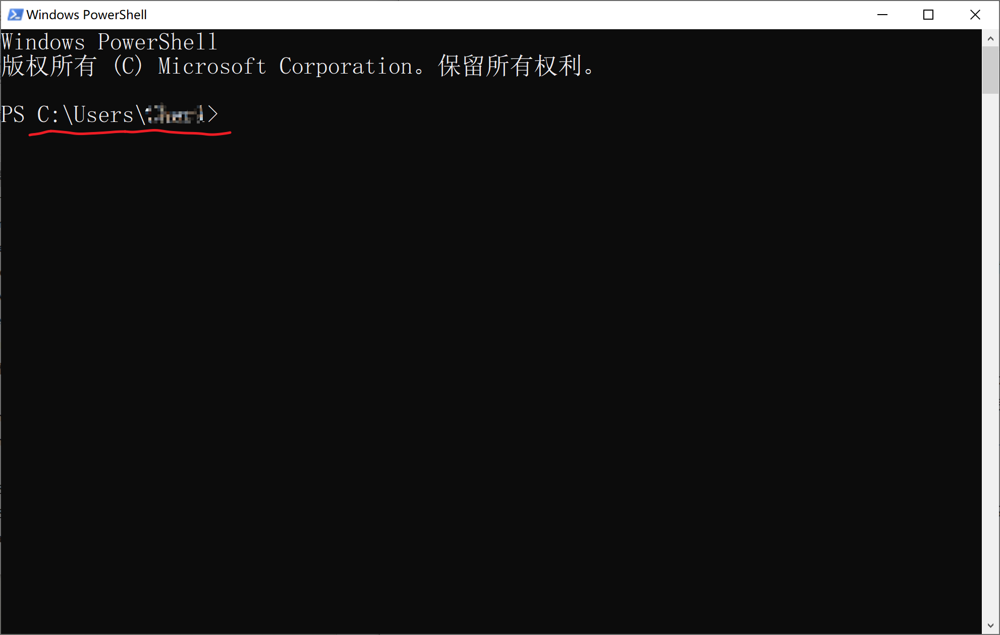
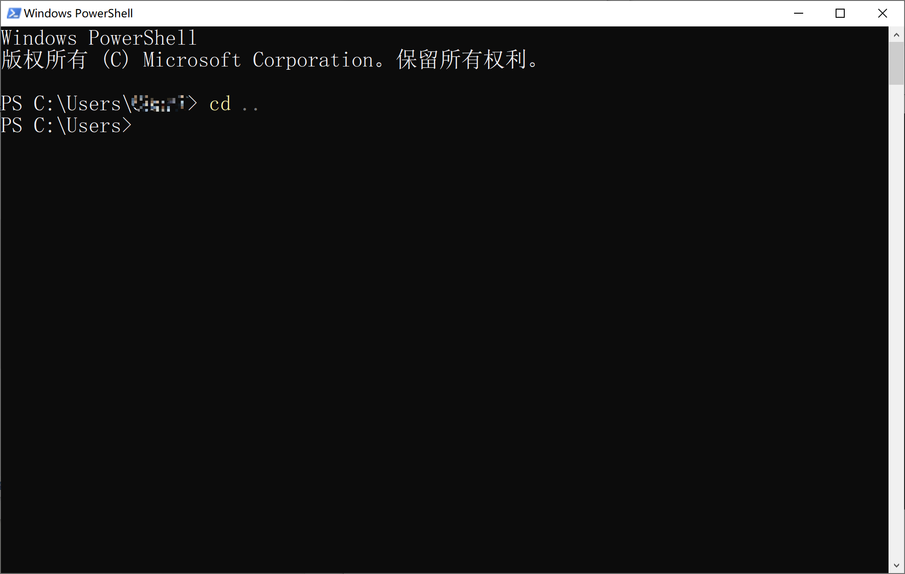
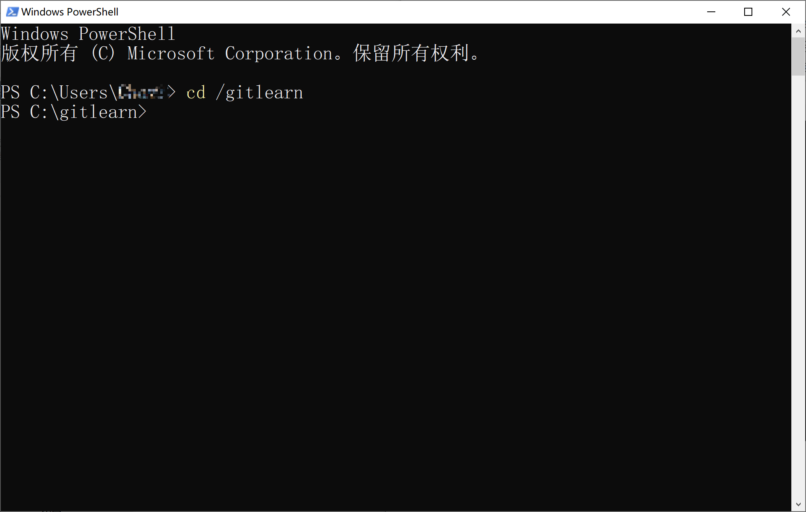
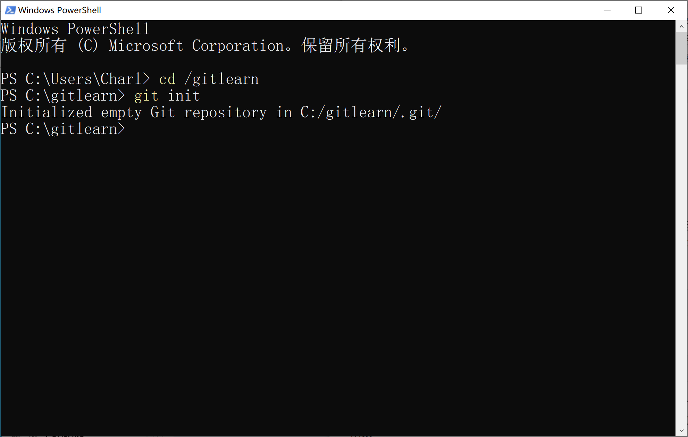
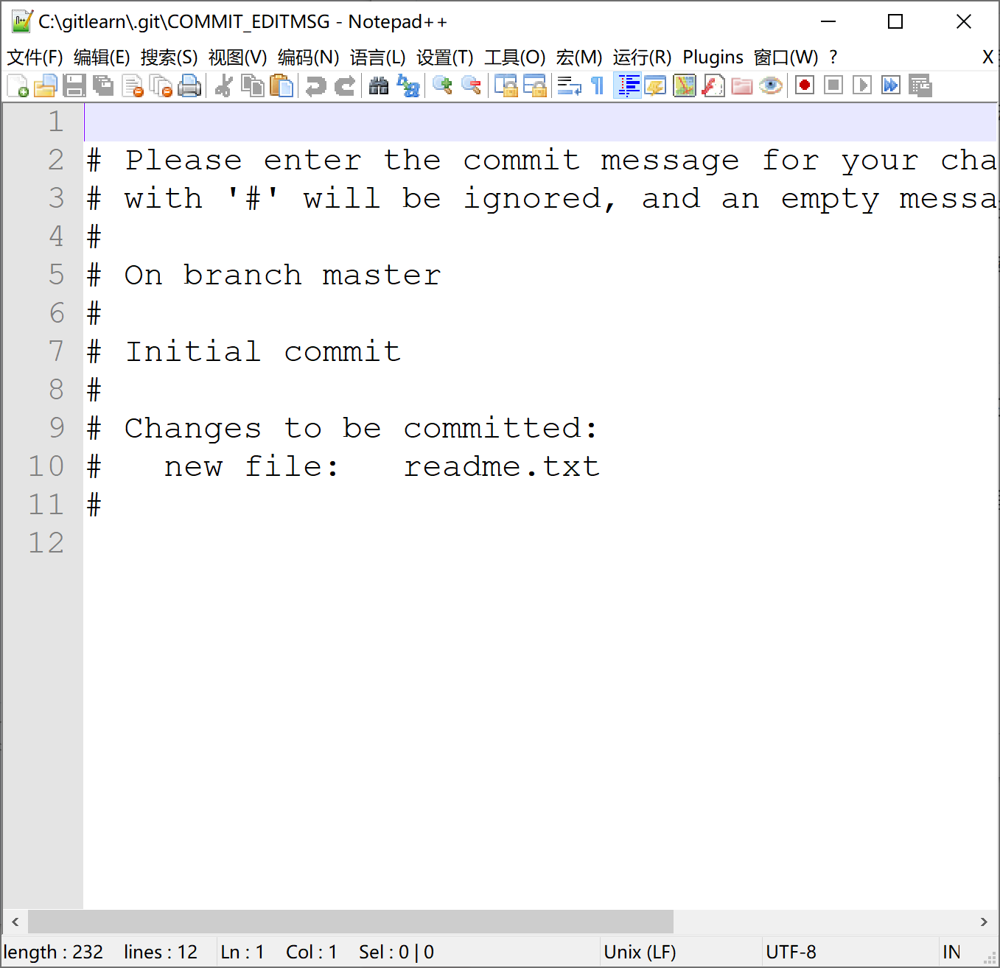
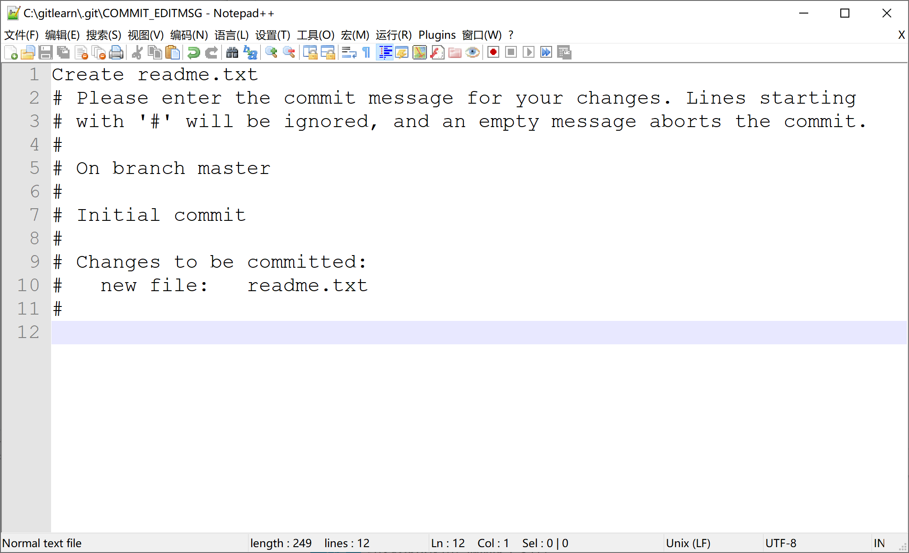
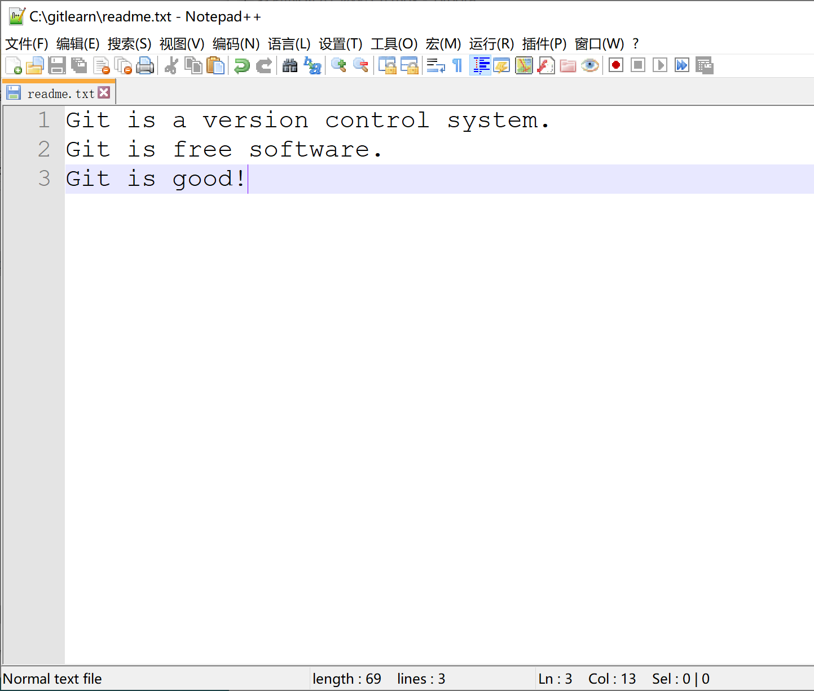
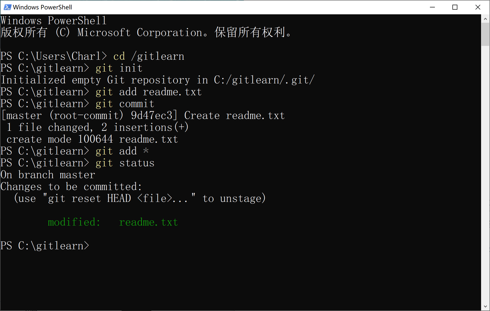
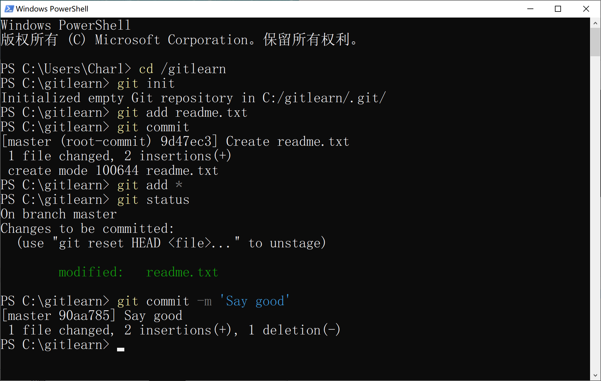

# Git版本库

## 创建版本库

### 一、命令行中文件与文件目录的基础知识

​	我们在图形界面中进入某个目录，通常是在资源管理器中点击该目录的图标实现的。而在命令行中，我们进入目录和退出都是通过命令来实现的。

#### 绝对目录与相对目录

在Linux系统中，系统的根目录统一使用一个正向斜杠`/`来表示。从根目录一层层表示到你想要的目录的方式叫绝对目录。而相对目录则是从你的当前目录算起，`..`表示上一层目录，`.`表示本层目录。

我们举个例子，先按照我们最开始的时候提到的方式，打开命令行：`win-key`+`R`->`cmd`或`powershell`->`Enter`

我这里使用的是 Powershell，但所有的命令在cmd中也可以正常使用。对于MacOS 和Linux用户，你的目录结构可能与Windows的有所不同，但其操作命令的方式大同小异。

打开powershell后，你会看到当前命令行所在目录的指示。



我们先来了解第一个命令，叫做Come to Directory（进入目录），简称cd。记得一定是小写的cd。cd这个命令通常只会用到一个参数，就是目标目录。我们先从当前目录返回上一层目录：

```bash
cd ..
```

正如刚才所说，上一层目录是`..`，因此我们`cd ..`就是“进入上一层目录”的意思。



可以看到，现在已经进入了上一层目录。

类似地，你也可以使用绝对目录，从`/`开始一直写到你想要的目录：



好的，到这里我们就了解了命令行中目录的转移与切换了。

### 二、创建Git存储库

​	存储库（Repository）是Git重要的组织单位。通常，同一个项目的文件会在同一个存储库里。这也是常见的一种组织和管理文件的方式。我们也建议大家在日常使用中，也采用这样基于项目的管理方式。

​	我们现在为了学习Git建立一个文件夹，在我的示例中，我在C盘根目录下建立了gitlearn这个文件夹，大家可以在自己喜欢的位置创建，以后所有学习Git有关的文件都将保存在Git这个文件夹中。

​	首先我们在命令行里敲入前往这个文件夹的命令：

```powershell
cd /gitlearn
```

接下来，我们在这个文件夹创建Git存储库：

```bash
git init
```

这个命令的意思是，调用git，执行创建，会在你当前的文件夹下生成一个`.git`的文件夹，这个文件夹会保存git的依赖和其他文件，不建议在不了解的情况下强行修改这个文件夹的名字和这个文件夹里面的内容。

​	这个命令敲下去后回车，会出现如下提示，代表已经创建成功：



这个时候，你就可以在这个版本库下运行一系列的Git命令了。

### 三、把文件添加到Git

​	首先这里再明确一下，所有的版本控制系统，其实只能跟踪文本文件的改动，比如 TXT 文件，网页，所有的程序代码等等，Git 也不例外。版本控制系统可以告诉你每次的改动，比如在第5行加了一个单词“Linux”，在第8行删了一个单词“Windows”。而图片、视频这些二进制文件，虽然也能由版本控制系统管理，但没法跟踪文件的变化，只能把二进制文件每次改动串起来，也就是只知道图片从 100KB 改成了 120KB，但到底改了啥，版本控制系统不知道，也没法知道。

​	不幸的是，Microsoft 的 Word 格式是二进制格式，因此，版本控制系统是没法跟踪 Word 文件的改动的，前面我们举的例子只是为了演示，如果要真正使用版本控制系统，就要以纯文本方式编写文件。

​	因为文本是有编码的，比如中文有常用的 GBK 编码，日文有 Shift_JIS 编码，如果没有历史遗留问题，强烈建议使用标准的 UTF-8 编码，所有语言使用同一种编码，既没有冲突，又被所有平台所支持。

#### 我们特意讲一下编辑器的问题

​	其实早在安装Git的时候你也许就有这样的疑问，为什么Git不支持直接使用Windows自带的记事本来作为默认编辑器？

​	原因是 Microsoft 开发记事本的团队使用了一个比较特殊的方法来保存 UTF-8 编码的文件，他们在每个文件开头添加了 0xefbbbf（十六进制）这样的奇奇怪怪的字符，会导致你遇到很多不可思议的问题，比如，网页第一行可能会显示一个“?”，明明正确的程序一编译就报语法错误，等等，都是由记事本不符合行为带来的。这样做深层次的原因其实是微软的Windows生态的特立独行, 也可以理解为是一种不与已有的东西雷同的创新. 在这样的观念指导下, 微软的很多东西都会有类似的问题,  比如在设计编译器的时候, 除了微软外的所有主流的类UNIX系统, 包括Linux和MacOS都是一种配置, 而Windows却是另一种配置. 为了减少这样的问题, 我们往往需要借助一些更高级, 更强大的工具来实现可移植性, 保证我们做的工作即使换了一台电脑也可以正常使用. 所以还是推荐下载[Notepad++](http://notepad-plus-plus.org/)或者[Visual Studio Code](https://code.visualstudio.com)代替记事本，不但功能强大，而且免费！记得把 编辑器的默认编码设置为 UTF-8 without BOM 即可，例如notepad++：

 


你也可以使用Vim， 它刚开始学起来非常麻烦，但熟练使用后会跟命令行一样，行云流水，让人爱不释手。Vim的使用就不再介绍了

​	为了能够让我们的存储库像模像样一点，我们创建一个叫做`readme.txt`的文件，并在里面写上如下内容：

```markdown
Git is a version control system.
Git is free software.
```

接下来，保存。一定要放到 `gitlearn`目录下（子目录也行），因为这是一个 Git 仓库，放到其他地方 Git 再厉害也找不到这个文件。

​	和把大象放到冰箱需要 3 步相比，把一个文件放到 Git 仓库只需要两步：

第一步，用命令`git add`告诉 Git，把文件**添加**到仓库的暂存区（Status)：

```bash
git add readme.txt
```

执行上面的命令，没有任何显示，这就对了，Unix 的哲学是“没有消息就是好消息”，说明添加成功。

最常见的报错有两种，一种是你只敲了文件名`readme`，却没有敲拓展名`.txt`，一定要敲完整的文件名`readme.txt`

第二种是你没能在仓库里做这件事， 参阅前面的内容，在`gitlearn`这个目录下面创建文件就好了。

第二步，用命令`git commit`告诉 Git，把文件**提交**到仓库：

```bash
git commit
```

这个时候会蹦出来一个文本编辑器，让你输入本次提交的说明，可以输入任意内容，当然最好是有意义的，这样你就能从历史记录里方便地找到改动记录。

如果你像我一样使用的是Notepad++，那么你遇到的界面大概率是这样的：



填写好提交信息后，按`ctrl`+`S`保存，再按`alt`+`F4`关闭这个窗口



接下来，你的命令行就会显示提交成功的信息：


至此，提交就大功告成啦！


还有一种办法，可以不调用Notepad++，直接在命令中写好commit message，就是使用commit命令的`-m`参数。为了演示这个用法，我们用Notepad++打开`readme.txt`，添加一行内容，比如：



`ctrl`+`s`保存，再使用一次add命令。顺便介绍一下，可能有些同学会疑问，如果有太多文件需要添加，难道要一个个`add`进去吗？其实这又涉及到一个目录的相关知识，在大多数系统中星号`*`代表“全部”的意思。如果你`add *`，就说明你要`add`当前文件夹里的全部内容。比如我们试试这个命令：

```bash
git add *
```

​											

什么也不会出现，但是当你使用使用`git status`查看当前存储库状态的时候，你会发现文件已经被添加跟踪了：




这个时候，我们通过`-m`参数来进行`commit`。下面是这个命令的原型（**不要敲进命令行哦**）：

```bash
git commit -m '<commit message>'
```

这里解释一下，`-m`这个参数接受一个字符串，这个字符串必须用双引号`"`或者单引号`'`包裹起来，字符串的内容就是你的commit message。

下面我们来使用这个方法进行提交：

```bash
git commit -m 'Say good'
```

效果大概是这样的：



如果你看到跟我差不多的提示（不用完全一样），就说明提交成功了。

