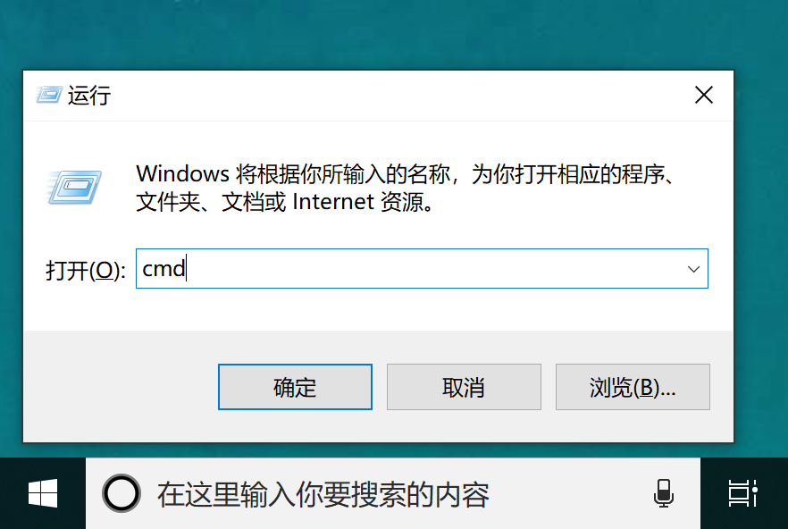
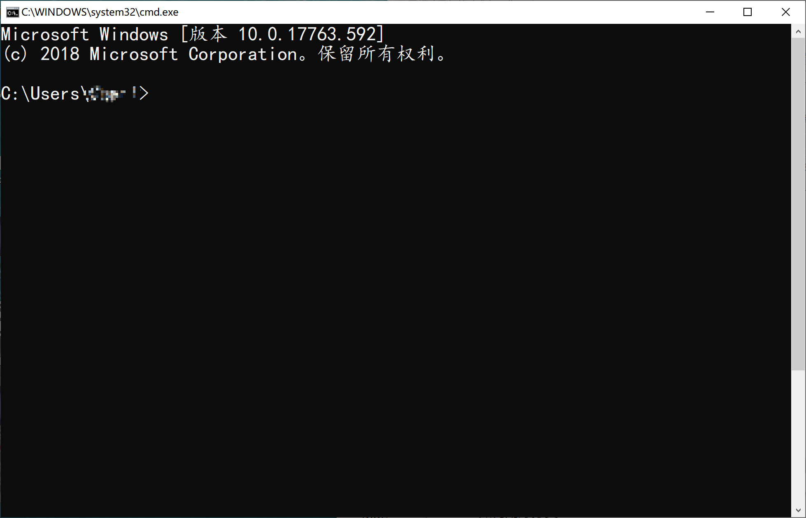

# 思想动员与战斗准备工作

​	前面介绍了这么多，我们终于准备开始进入正题了。在此之前，我们还要进行一些准备工作。

### 了解自己的电脑

​	如果没有什么意外，大多数人，都在使用Windows操作系统的电脑。也有不少人在使用MacOS。无论是这二者中的哪一个，都是典型的图形化界面（GUI）的操作系统。这意味着在日常的使用过程中，鼠标、触控板、触摸屏的使用是最常见的操作方式。Windows10操作系统是目前最常见的Windows版本。其还分成家庭版、专业版和企业版等等。通常专业版和企业版会有一些独享的软件和功能。此外，无论是苹果的MacOS还是Windows，其实都是有命令行程序的。苹果的叫Terminal（终端），Windows的叫`cmd`（命令提示符），而专业版和企业版自带了`Powershell`，家庭版的用户也不用担心，`Powershell`现在也已经部分开源，可以从微软的官网找到安装的指南（详见附录）。

### 学会查找资料

​	也许你已经习惯了有什么问题问老师问同学，而随着互联网的发展，搜索引擎已经可以快速地帮我们找到很多你想知道的知识。重要的是，尽管你知道它在那里，你也要学会使用它。

​	对于绝大多数的问题，上百度或者必应直接把问题打在搜索框里就能出答案了。但有些问题答案的来源恐怕不那么直接。在你一次搜索不能直接得到答案时，可以试试根据第一次搜索得到的一些关键词去进行多次的搜索。而对于查到的资料也不要畏难，无论是浅显易懂的教程，中规中矩的文档，别人写的博客还是长篇大论的硕士论文，都可以成为你学习的材料。

### 勇于面对命令行

​	如果你使用的是Windows电脑，可以按住键盘上的Windows徽标键（`Win-key`）和 `R` 键。此时你的电脑(屏幕上（通常是左下角）会出现一个“运行”窗口。




在窗口的输入框中输入`cmd`，按下回车，便打开了Windows自带的命令行工具“命令提示符”。




或许在过去若干年使用电脑的经历中你可能几乎没有用过这个东西，但请记住它，并且，习惯它黑洞洞的模样。尽管它长得不太好看，但作为命令行工具，它拥有着相当强大的能力。

​	如果你使用的是专业版的Windows操作系统，可以同样地在”运行“中输入`Powershell`，这是一个比`cmd`更加强大的工具。虽然它依然长得不太好看，但它可以做到很多鼠标点来点去做不到的事情。

​	如果你听说过Linux操作系统，你更应该勇敢地尝试和使用它的命令行界面。Linux的命令行界面叫做Bash。它也十分强大。

​	由于早期Linux的交互界面是终端命令行，所以在敲入命令后，结果会和命令显示在同一个界面上， 就像这样：

```
$ git status
# On branch dev
# Changes to be committed:
#   (use "git reset HEAD <file>..." to unstage)
#
#       new file:   hello.py
#
# Changes not staged for commit:
#   (use "git add <file>..." to update what will be committed)
#   (use "git checkout -- <file>..." to discard changes in working directory)
#
#       modified:   readme.txt
#
```

​	通常，人们在展示Bash命令及其显示出来的结果时，会像上面这样，将命令和结果放在同一个代码框里。如果是命令，前面会有命令提示符`$`。所以，以后看到这样大段大段的代码框，记得认清命令提示符`$`，它后面跟着的就是命令。

​	以上这些命令行，虽然看起来丑陋，但他们能够**让聪明的人干任何他们想干的事**。命令行属于干预面对符号的人，只有符号才能够完全操纵计算机。鼠标虽然是很好的工具，但是它的表达能力是有限的，你很难光用鼠标就让电脑完全明白你的意思。毕竟相比起键盘至少数十个按钮来说，三个按钮能表示的东西太少了。

​	熟练的黑客可以使用Linux快速地敲下一行行命令，组合系统里的各种工具来完成一个任务。很多工具本身就是一个黑客工具，压根就没有考虑图形界面的用户们。图形界面的优势是展示数据的方式多样，但从使用者的角度看，它混淆了数据的展示和数据本身。黑客和科学家们的很多工作其实是，把一堆数据扔进一个程序，得到另一堆数据，再扔进另一个程序。他们不关心数据的展示，他们只关心数据本身。

​	而命令行的使用也可以极大地提高你的工作效率。熟练使用命令行和快捷键，能够让你的双手几乎不离开键盘进行工作。例如刚刚打开命令行，在命令行里输入一套命令的流程，如果你使用鼠标，需要在“开始”-->"所有程序“-->"Windows附件"---->”命令提示符"，而这一套流程如果熟练地使用快捷键和命令行，完全可以变成

`win-key`+`R`-->`cmd`-->`Enter`-->`git`

这一套动作。行云流水，快不可挡。

​	所以，不要惧怕命令行，勇敢地拿起命令行，勇敢地面对符号，勇敢地探索一个属于黑客的世界吧！

### Markdown入门

​	你一定用过Microsoft word，这是一款字处理软件，通常人们会先编辑好内容，再用鼠标点点点来调格式，甚至编辑一会儿内容，花点时间调格式，再编辑一会儿内容。这样做不仅会使你难以专注于写作本身，更重要的是没有特定的软件根本无法读取你的`.docx`文件。而Markdown是一种标记语言，通过在文本中添加一些特定的标记，来实现格式的确定。一方面，在有特定的软件的条件下，可以阅读到带有格式的文本，而没有特定软件的情况下，可以直接以文本的方式打开，尽管中间会有一些符号，但内容没有丢失。

​	最关键的是，Markdown能够让你把写作和排版融为一体，双手不离开键盘实现格式和文本的操作。（你似乎发现了，双手不离开键盘是一件非常重要也是非常爽的事情）。因此，学习一点Markdown还是很有必要的。

​	Markdown的语法很简单，例如常见的添加标题，可以在标题前面加井号`#`来实现。

```markdown
# 这是一个标题
## 这是一个二级标题
### 这是一个三级标题
###### 通常支持六级标题
```

效果：


而如果想要加粗/斜体/下划线等，也可以分别通过星号`*`，HTML的`<u>`标签和其他特定的符号来使用

```markdown
*斜体*
**加粗**
<u>下划线</u>
~~删除线~~
[超链接](链接地址)
```

当你需要引用代码时，可以使用键盘上”1“键旁边的`~/‘`键来使用

```markdown
​```代码使用的语言
大段大段的代码

`一小段代码`
```

即使你现在不太熟悉也没关系，我们会慢慢在使用中掌握它。之所以学习markdown，很大程度上也是因为，在一些Git平台（比如Github），说明文档都是使用Markdown编写的。

