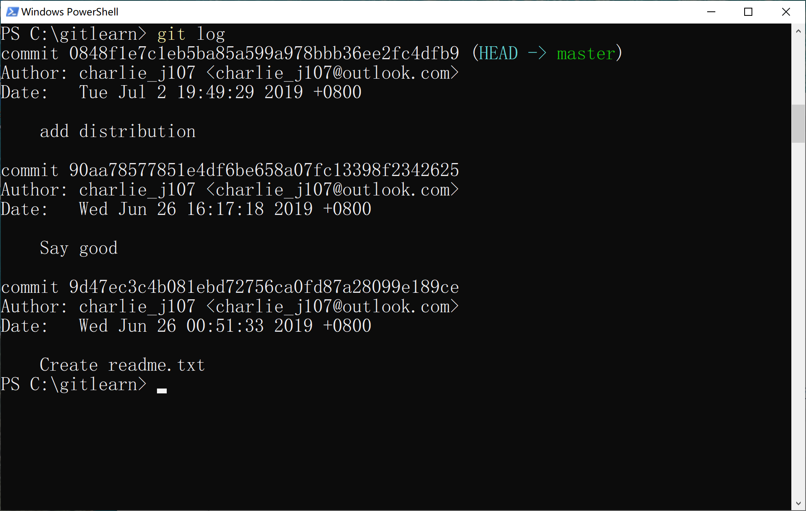

# 版本回退

现在，你已经学会了修改文件，然后把修改提交到 Git 版本库，现在，再练习一次，修改 readme.txt 文件如下：

```
Git is a distributed version control system.
Git is free software distributed under the GPL.
```

然后尝试提交：

```
git add readme.txt
git commit -m "append GPL"
[master 3628164] append GPL
 1 file changed, 1 insertion(+), 1 deletion(-)
```

 

像这样，你不断对文件进行修改，然后不断提交修改到版本库里，就好比玩 RPG 游戏时，每通过一关就会自动把游戏状态存盘，如果某一关没过去，你还可以选择读取前一关的状态。有些时候，在打 Boss 之前，你会手动存盘，以便万一打 Boss 失败了，可以从最近的地方重新开始。Git 也是一样，每当你觉得文件修改到一定程度的时候，就可以“保存一个快照”，这个快照在 Git 中被称为 commit。一旦你把文件改乱了，或者误删了文件，还可以从最近的一个 commit 恢复，然后继续工作，而不是把几个月的工作成果全部丢失。

 

现在，我们回顾一下 readme.txt 文件一共有几个版本被提交到 Git 仓库里了：

 

**版本1**：Creat readme.txt

```
Git is a version control system.
Git is free software.
```

 

**版本2**：Say good

```
Git is a distributed version control system.
Git is free software.
```

 

**版本3**：add distribution

```
Git is a distributed version control system.
Git is free software distributed under the GPL.
```

 

当然了，在实际工作中，我们脑子里怎么可能记得一个几千行的文件每次都改了什么内容，不然要版本控制系统干什么。版本控制系统肯定有某个命令可以告诉我们历史记录，在 Git 中，我们用`git log`命令查看：

```bash
git log
```

 

`git log`命令显示从最近到最远的提交日志，我们可以看到 3 次提交，最近的一次是`append GPL`，上一次是`add distributed`，最早的一次是`wrote a readme file`。 如果嫌输出信息太多，看得眼花缭乱的，可以试试加上`--pretty=oneline`参数：

 

```bash
git log --pretty=oneline
```

 

需要友情提示的是，你看到的一大串类似`3628164...882e1e0`的是`commit id`（版本号），和 SVN 不一样，Git 的 commit id 不是 1，2，3……递增的数字，而是一个 SHA1 计算出来的一个非常大的数字，用十六进制表示，而且你看到的 commit id 和我的肯定不一样，以你自己的为准。为什么 commit id 需要用这么一大串数字表示呢？因为 Git 是分布式的版本控制系统，后面我们还要研究多人在同一个版本库里工作，如果大家都用 1，2，3……作为版本号，那肯定就冲突了。

 

每提交一个新版本，实际上 Git 就会把它们自动串成一条时间线。

好了，现在我们启动时光穿梭机，准备把 readme.txt 回退到上一个版本，也就是 “add distributed” 的那个版本，怎么做呢？

 

首先，Git 必须知道当前版本是哪个版本，在 Git 中，用 HEAD 表示当前版本，也就是最新的提交`3628164...882e1e0`（注意我的提交 ID 和你的肯定不一样），上一个版本就是`HEAD^`，上上一个版本就是`HEAD^^`，当然往上 100 个版本写 100 个`^`比较容易数不过来，所以写成 `HEAD~100`。

现在，我们要把当前版本“add distribution”回退到上一个版本“Say good”，就可以使用`git reset`命令：

```
git reset --hard HEAD^
```

 

`--hard`参数有啥意义？这个后面再讲，现在你先放心使用。

 

看看 readme.txt 的内容是不是版本`add distributed`：


果然。

还可以继续回退到上一个版本`wrote a readme file`，不过且慢，然我们用`git log`再看看现在版本库的状态：

```
git log
```

 

最新的那个版本`add distribution`已经看不到了！好比你从 21 世纪坐时光穿梭机来到了 19 世纪，想再回去已经回不去了，肿么办？

 

办法其实还是有的，只要上面的命令行窗口还没有被关掉，你就可以顺着往上找啊找啊，找到那个`add distribution`的`commit id`是`0848f...`，于是就可以指定回到未来的某个版本：

 

```
git reset --hard 0848f1e7c1eb5ba85a599a978bbb36ee2fc4dfb9
```

 

版本号没必要写全，前几位就可以了，Git 会自动去找。当然也不能只写前一两位，因为 Git 可能会找到多个版本号，就无法确定是哪一个了。

 

再小心翼翼地看看 readme.txt 的内容：


果然，又回来了。

 

Git 的版本回退速度非常快，因为 Git 在内部有个指向当前版本的 HEAD 指针，当你回退版本的时候，Git 仅仅是把 HEAD 从指向`add distribution`：

 


改为指向 say good(图中最新版本是append GPL, distribution是一个较旧的版本：

 


 

然后顺便把工作区的文件更新了。所以你让 HEAD 指向哪个版本号，你就把当前版本定位在哪。


 

现在，你回退到了某个版本，关掉了电脑，第二天早上就后悔了，想恢复到新版本怎么办？找不到新版本的 commit id 怎么办？

 

在 Git 中，总是有后悔药可以吃的。当你用`$ git reset --hard HEAD^`回退到`add distributed`版本时，再想恢复到`add distruibution`，就必须找到`add distribution`的`commit id`。Git 提供了一个命令`git reflog`用来记录你的每一次命令：

 ```
git reflog
 ```


终于舒了口气，第二行显示`add distruibution`的`commit id`是`0848...`，现在，你又可以乘坐时光机回到未来了。

 

 

## 小结

 

现在总结一下：

 

HEAD 指向的版本就是当前版本，因此，Git 允许我们在版本的历史之间穿梭，使用命令`git reset --hard commit_id`。

 

穿梭前，用`git log`可以查看提交历史，以便确定要回退到哪个版本。

 

要重返未来，用`git reflog`查看命令历史，以便确定要回到未来的哪个版本。

 

