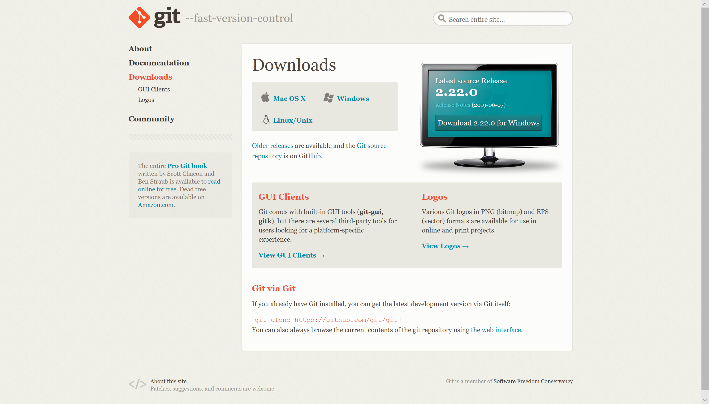
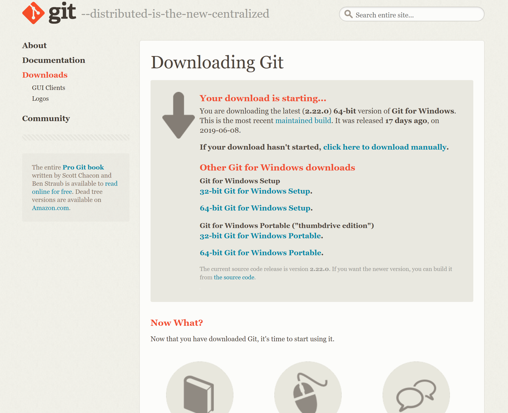
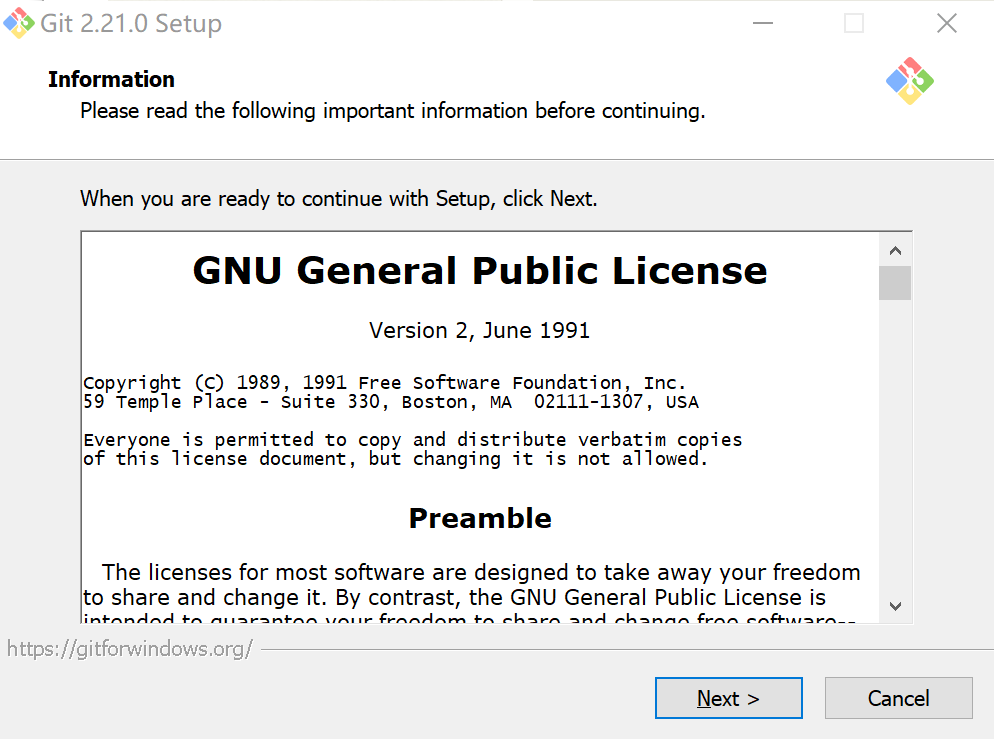
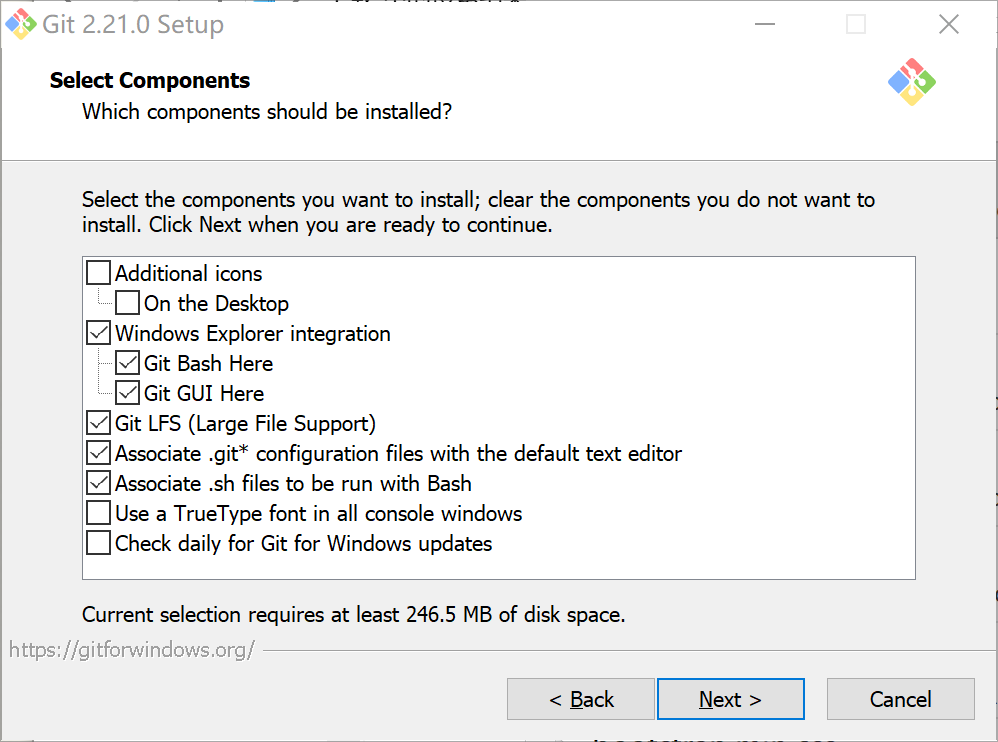
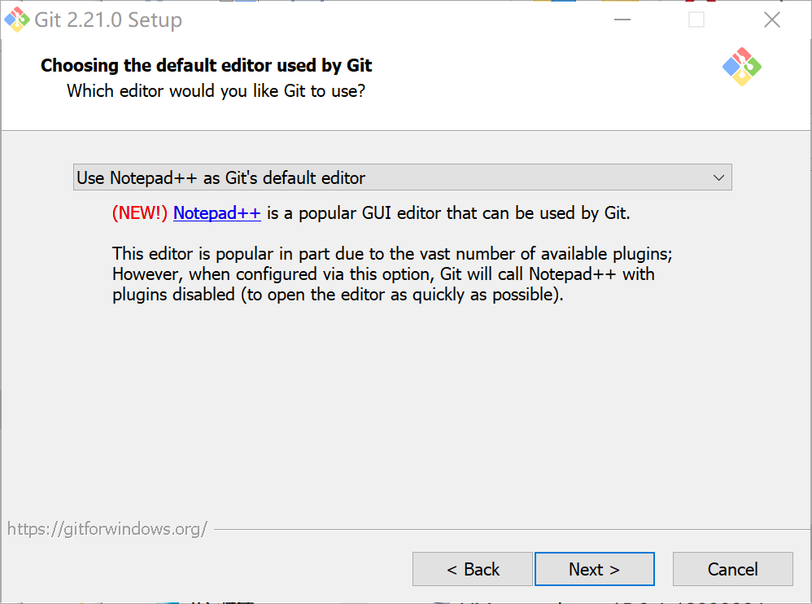
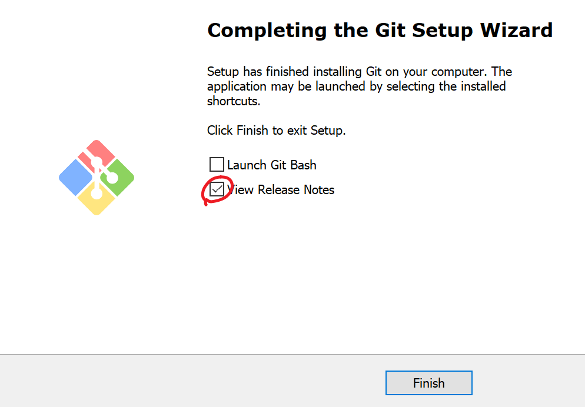

# 安装Git

​	根据不同的操作系统，有不同的安装方式。

### Linux

由于最开始Git是为Linux设计的，所以它在Linux系统上的安装十分方便。例如在常见的Ubuntu发行版的Linux系统中，安装Git只需要一行命令：

```bash
sudo apt install git
```

在CentOS中，命令是这样的：

```bash
yum install git
```

### Windows

当然，我们绝大多数的同学可能还是在使用Windows系统，那么Windows系统上安装Git是通过安装包来安装的。

​	与安装大多数软件一样，我们先下载Git的安装包。你可以到[Git官网](https://git-scm.com/)找到Git的[下载页面](https://git-scm.com/downloads)



点击Windows版本，可以进入Windows版本Git的下载页面，通常此时下载会开始，你也会看到这样的界面



下载下来后，双击这个安装包

如果Windows提示你是否允许更改，请选择”是“。请不要小看这个弹窗，这是Windows系统保护你的电脑的最后一道防线。如果你不知道你在干什么，甚至你还什么也没做它就弹出来，那你就要小心了。

接下来你会看到Git的安装界面。

第一页是大名鼎鼎的GNU General Public License协议，即自由软件协议。如果你有兴趣，可以读一下，领略一下开源思想的魅力。



点击”Next”，会进入组件选择的页面

通常情况下，是不需要做什么特定的配置，默认的配置就好。



Next，进入选择默认编辑器的页面。之后我们会讲到，有时候你需要在Git的使用中输入一些文本信息。你可以使用大名鼎鼎的vim（默认选项），尽管这会有些麻烦，您可能还需要稍微学习一些vim的基本操作。当然，如果你嫌麻烦，也可以使用Notepad++，或者Visual Studio Code。其中Notepad++安装比较简单，也符合大多数人的操作习惯，初学者可以选用。我们的教程中使用并强烈建议使用Notepad++作为我们的默认编辑器。



接下来的设置属于比较复杂的配置，解释起来也不那么容易。过度关注这些东西可能会造成不必要的困扰，一路Next即可。如果您保有一颗好奇心，可以在附录中研究这些东西。

最后安装的进度条跑完，记得看一眼安装界面。这一点对于生活在中国的我们尤其重要。幸亏Git 是良心软件，一些无良软件会在最后这个结束界面给你勾选一些奇奇怪怪的东西。Git只给我们勾选了一个Release Notes（更新说明），愿意看可以留着，不愿意看就把它取消掉，点击Finish，就完成了。




### MacOS

Mac的安装方式与Windows差不多，也是下载安装包之后进行安装。因为我手上没有mac电脑，所以难以为大家做演示。希望有条件的同学能够自行摸索。如果有什么问题，可以随时向身边的老师求助。